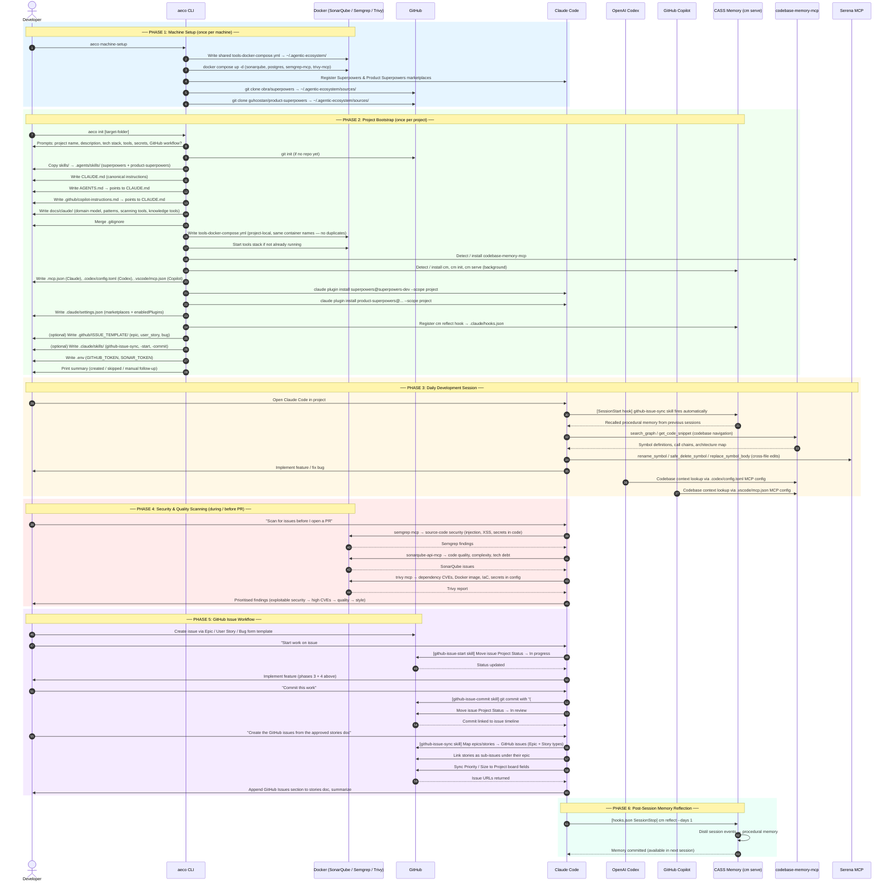

# Agentic Ecosystem (`aeco`)

[](https://nodejs.org)
[](LICENSE)

A zero-friction CLI that bootstraps a **consistent, production-grade agentic development environment** across **Claude Code**, **OpenAI Codex**, and **GitHub Copilot** — simultaneously.  
One command per machine. One command per project. No manual wiring.

---

## Table of Contents

- [What is the Agentic Ecosystem?](#what-is-the-agentic-ecosystem)
- [Prerequisites](#prerequisites)
- [Installation](#installation)
- [Workflow Overview](#workflow-overview)
- [End-to-End Workflow Diagram](#end-to-end-workflow-diagram)
- [Step 1 — Machine Setup](#step-1--machine-setup-run-once-per-machine)
- [Step 2 — Project Bootstrap](#step-2--project-bootstrap-run-once-per-project)
- [Generated File Tree](#generated-file-tree)
- [MCP Server Set](#mcp-server-set)
- [Skills System](#skills-system)
- [GitHub Issue Workflow](#github-issue-workflow)
- [Secrets Handling](#secrets-handling)
- [File Conflict Policy](#file-conflict-policy)
- [Testing](#testing)
- [Platform Notes](#platform-notes)
- [Troubleshooting](#troubleshooting)

---

## What is the Agentic Ecosystem?

Modern AI coding agents (Claude Code, Codex, GitHub Copilot) are powerful in isolation, but each one expects its own configuration format, its own instruction file, its own MCP server list, and its own skill or plugin format. When you add security scanning, memory systems, and a GitHub issue workflow on top, the per-project setup tax compounds fast — and drifts between projects.

**`aeco` solves this.** It is an *agentic environment installer and configurator*: a single CLI that provisions a **fully-integrated, production-grade AI development environment** in any project folder, wiring every agent to the same shared infrastructure, the same shared memory, the same scanning tools, and the same skill library — in a single interactive run.

The result is a project where:

- **All three agents** (Claude Code, Codex, Copilot) read the same project instructions from one canonical file (`CLAUDE.md`) — nothing to keep in sync.
- **All three agents** share the same MCP server set — codebase intelligence, procedural memory, security scanning, GitHub API — written once into each tool's native config format.
- **All three agents** have access to the same [Superpowers](https://github.com/obra/superpowers) and [Product Superpowers](https://github.com/guhcostan/product-superpowers) skill libraries.
- **Security scanning** (SonarQube, Semgrep, Trivy) runs locally in Docker, shared across every project on the machine — no cloud dependency, no per-project container duplication.
- **Procedural memory** ([CASS Memory System](https://github.com/Dicklesworthstone/cass_memory_system)) captures what each agent session learned and makes it available in future sessions automatically via a post-session `cm reflect` hook.
- **GitHub Issues** are a first-class citizen: epics, user stories, and bugs flow from issue creation → agent pickup → implementation → review, with Project board status tracked at every step by dedicated Claude skills.

`aeco` is opinionated by design. It encodes a battle-tested configuration that would otherwise take hours to hand-wire — and makes it reproducible across every project and every machine.

---

## Prerequisites

| Tool | Required for | Install |
|---|---|---|
| **Node.js ≥ 18** | `aeco` itself | [nodejs.org](https://nodejs.org) |
| **Git** | `aeco init` (git init, skill cloning) | [git-scm.com](https://git-scm.com) |
| **Docker Desktop** | SonarQube, Semgrep, Trivy MCP servers | [docker.com/products/docker-desktop](https://www.docker.com/products/docker-desktop/) |
| **Claude Code CLI** (`claude`) | Plugin installation & marketplace registration | [claude.ai/code](https://claude.ai/code) *(optional — skipped gracefully if absent)* |
| **`uvx` / uv** | Serena MCP server (code intelligence) | [astral.sh/uv](https://github.com/astral-sh/uv) |
| **CASS Memory System** (`cm`) | Procedural memory MCP | Auto-installed by `aeco init` |
| **codebase-memory-mcp** | Codebase context MCP | Auto-installed on Windows; manual on macOS/Linux |

---

## Installation

```bash
# 1. Clone this repository
git clone https://github.com/Supahfly27Organization/Development-Environment.git
cd Development-Environment

# 2. Install Node dependencies
npm install

# 3. Expose the `aeco` command globally
npm link
```

Verify:

```bash
aeco
# Usage:
#   aeco machine-setup   Set up shared machine-level infra
#   aeco init            Bootstrap a project
```

---

## Workflow Overview

```
┌─────────────────────────────────────┐
│  aeco machine-setup  (once/machine) │
│  • Docker stack (sonar/semgrep/trivy│
│  • Marketplace registration         │
│  • Skill source cache               │
│    (~/.agentic-ecosystem/sources/)  │
└─────────────────┬───────────────────┘
                  │
                  ▼  (repeat for each project)
┌─────────────────────────────────────┐
│  aeco init [target-folder]          │
│  • git init (if needed)             │
│  • Copy skills → .agents/skills/   │
│  • Write CLAUDE.md / AGENTS.md /   │
│    copilot-instructions.md          │
│  • Write .gitignore                 │
│  • Start Docker tools stack         │
│  • Install / wire codebase-memory   │
│  • Install / wire CASS memory (cm)  │
│  • Write .mcp.json, config.toml,   │
│    .vscode/mcp.json                 │
│  • Install Claude Code plugins      │
│  • Set up GitHub Issue workflow     │
│  • Write .env (secrets)             │
└─────────────────────────────────────┘
```

---

## End-to-End Workflow Diagram

The diagram below maps the complete lifecycle — from first-time machine setup through daily development sessions, security scanning, GitHub Issue management, and post-session memory reflection.



---

## Step 1 — Machine Setup *(run once per machine)*

```bash
aeco machine-setup
```

Interactively:

1. **Docker stack** — Asks for your *projects root* directory (e.g. `C:\git` or `~/projects`). Writes a shared `tools-docker-compose.yml` to `~/.agentic-ecosystem/` and starts these containers once for the whole machine:

   | Container | Purpose |
   |---|---|
   | `sonarqube` + `postgres` | Static analysis dashboard & API |
   | `semgrep-mcp` | Semgrep rule-based scanning via MCP |
   | `trivy-mcp` | Vulnerability / SBOM scanning via MCP |

2. **Marketplace registration** — Registers `obra/superpowers` and `guhcostan/product-superpowers` with the Claude Code CLI (if it is on `PATH`). Plugin *installation* is deferred to `aeco init` so each plugin is scoped to its own repository.

3. **Skill source cache** — Shallow-clones both skill repos into `~/.agentic-ecosystem/sources/` so `aeco init` can copy skills without a network hit. Automatically pulls the latest version if the cache already exists.

---

## Step 2 — Project Bootstrap *(run once per project)*

```bash
cd my-project
aeco init
# or: aeco init /path/to/target-folder
```

Walks through the following steps in order, prompting before any destructive action:

### 2.1 git init
Detects whether `.git` already exists. If not, asks to run `git init`.

### 2.2 Skills
Copies the full skill tree from both cached source repos into `.agents/skills/`.
- If a destination file is **identical** → silently skipped.
- If it **differs** → prompts: *keep / overwrite / append*.

Skills in `.agents/skills/` are discovered natively by Codex and GitHub Copilot without any extra config.

### 2.3 Instruction files
Generates the agent instruction layer:

| File | Role |
|---|---|
| `CLAUDE.md` | **Single source of truth** — project name, description, tech stack, working rules |
| `docs/claude/DOMAIN_MODEL.md` | Domain model reference (edit per project) |
| `docs/claude/PATTERNS.md` | Architectural patterns (edit per project) |
| `docs/claude/SCANNING_TOOLS.md` | When and how to invoke each scanning MCP server |
| `docs/claude/KNOWLEDGE_TOOLS.md` | When and how to use memory / knowledge MCPs |
| `AGENTS.md` | Codex pointer → `CLAUDE.md` |
| `.github/copilot-instructions.md` | Copilot pointer → `CLAUDE.md` |

### 2.4 `.gitignore`
Merges a standard ignore list into any existing `.gitignore`, adding only lines that are not already present.

### 2.5 Docker tools stack
Writes `tools-docker-compose.yml` to the project root using the same container names as the machine-level stack. Running both is a no-op — there are no duplicate containers. Starts the stack if it is not already up.

### 2.6 `codebase-memory-mcp`
Detects the binary. On **Windows**, offers to download the latest release from [DeusData/codebase-memory-mcp](https://github.com/DeusData/codebase-memory-mcp/releases) automatically. On **macOS/Linux**, provides the manual install URL.

### 2.7 CASS Memory System (`cm`)

| Sub-step | What happens |
|---|---|
| Install | Scoop on Windows, official install script on macOS/Linux |
| `cm init` | Initialises configuration if not already done |
| `cm serve` | Starts the MCP HTTP server at `http://127.0.0.1:8765/` in the background |
| Hook | Adds a `cm reflect` entry to `.claude/hooks.json` so Claude reflects on each session automatically |

### 2.8 MCP servers
Builds a unified server definition set and writes it to all three config locations:

| Config file | Used by |
|---|---|
| `.mcp.json` | Claude Code |
| `.codex/config.toml` | OpenAI Codex |
| `.vscode/mcp.json` | GitHub Copilot (VS Code) |

See [MCP Server Set](#mcp-server-set) for the full server list.

### 2.9 Claude Code plugins
Installs **Superpowers** and **Product Superpowers** at `--scope project` so they are active for this repository only. Also writes `.claude/settings.json` with `extraKnownMarketplaces` and `enabledPlugins`.

### 2.10 GitHub Issue Workflow *(optional — prompted)*
If you opt in:

| Added | Purpose |
|---|---|
| `.github/ISSUE_TEMPLATE/epic.yml` | Epic issue form |
| `.github/ISSUE_TEMPLATE/user_story.yml` | User story form |
| `.github/ISSUE_TEMPLATE/bug.yml` | Bug report form |
| `.claude/skills/github-issue-sync/` | Maps approved stories doc → GitHub issues (epic + sub-issue links, Priority/Size field sync) |
| `.claude/skills/github-issue-start/` | Moves issue to "In progress" before work begins |
| `.claude/skills/github-issue-commit/` | Commits with `(#N)` suffix; moves issue to "In review" |
| SessionStart hook | Auto-runs the sync skill at the start of each Claude Code session |

### 2.11 Secrets
Prompts for `GITHUB_TOKEN` and `SONAR_TOKEN`, then writes them to `.env` (already covered by `.gitignore`).

---

## Generated File Tree

```
<project>/
├── .agents/
│   └── skills/                  # Superpowers + Product Superpowers skills
├── .claude/
│   ├── hooks.json               # cm reflect post-session hook
│   ├── settings.json            # Marketplaces + enabled plugins
│   └── skills/                  # (optional) GitHub Issue workflow skills
├── .codex/
│   └── config.toml              # Codex MCP server config
├── .github/
│   ├── copilot-instructions.md  # Pointer → CLAUDE.md
│   └── ISSUE_TEMPLATE/          # (optional) epic, user_story, bug forms
├── .vscode/
│   └── mcp.json                 # Copilot MCP server config
├── docs/
│   └── claude/
│       ├── DOMAIN_MODEL.md
│       ├── PATTERNS.md
│       ├── SCANNING_TOOLS.md
│       └── KNOWLEDGE_TOOLS.md
├── AGENTS.md                    # Pointer → CLAUDE.md
├── CLAUDE.md                    # ← Single source of truth for all agents
├── .env                         # Secrets (git-ignored)
├── .gitignore
├── .mcp.json                    # Claude MCP server config
└── tools-docker-compose.yml     # SonarQube, Semgrep, Trivy
```

---

## MCP Server Set

The same server set is written into all three config files (with appropriate format differences per tool):

| Server | Transport | Purpose |
|---|---|---|
| `codebase-memory-mcp` | `stdio` (local binary) | Indexes and searches the current codebase; preferred over grep/glob for symbol lookup, call chains, and architecture discovery |
| `cass-memory` | `url` (`http://127.0.0.1:8765/`) | CASS procedural + episodic memory; recalled at session start, committed at session end via `cm reflect` |
| `sonarqube` | `stdio` (`npx sonarqube-api-mcp`) | Code quality, bugs, complexity, tech debt; requires `SONAR_TOKEN` |
| `semgrep` | `stdio` (`docker exec semgrep-mcp`) | Source-code security scanning: injection, XSS, auth mistakes, secrets in code |
| `trivy` | `stdio` (`docker exec trivy-mcp`) | Dependency CVEs, Docker image vulnerabilities, IaC and config secrets |
| `github` | `stdio` (`docker run github-mcp-server`) | Full GitHub API (issues, PRs, Projects); requires `GITHUB_TOKEN` |
| `serena` | `stdio` (`uvx serena start-mcp-server`) | LSP-backed cross-file edits: rename symbol, safe delete, replace symbol body, compiler diagnostics |

**Scan priority guidance** (encoded in `docs/claude/SCANNING_TOOLS.md`):

| Scenario | Primary tool | Also use |
|---|---|---|
| Code quality / refactoring | SonarQube | Semgrep if security-sensitive |
| Application security | Semgrep | SonarQube for quality context; Trivy if deps/Docker involved |
| Dependencies / Docker / IaC | Trivy | Semgrep for source patterns |
| Secrets in source code | Semgrep | Trivy too if practical |
| Before PR | SonarQube → Semgrep → Trivy (if package/Docker/CI files changed) | — |
| Before release | All three | — |

---

## Skills System

Skills are Markdown files (`SKILL.md`) that give agents reusable, self-contained playbooks for common tasks. They live in `.agents/skills/<skill-name>/` and are discovered natively by Codex, GitHub Copilot, and Claude Code without any extra configuration.

`aeco` populates two skill libraries automatically:

| Library | Source | Content |
|---|---|---|
| **Superpowers** | `github.com/obra/superpowers` | General engineering workflows |
| **Product Superpowers** | `github.com/guhcostan/product-superpowers` | Product/story writing, user research workflows |

Additionally, if the GitHub Issue Workflow is enabled, three Claude-only skills are added:

| Skill | Trigger | What it does |
|---|---|---|
| `github-issue-sync` | Explicit (after story approval) | Maps an approved stories doc to GitHub issues — creates Epic + Story issue types, links sub-issues, syncs Priority/Size Project board fields |
| `github-issue-start` | Before implementation | Moves the linked issue's Project board status to *In progress* |
| `github-issue-commit` | After implementation | Commits with a `(#N)` suffix (no auto-close keywords); moves issue status to *In review* |

---

## GitHub Issue Workflow

When enabled, `aeco init` sets up a lightweight, fully-tracked development loop:

```
Issue created (epic / user story / bug form)
  → aeco init registers SessionStart hook
  → Claude session starts → github-issue-sync fires (after stories are approved)
  → Developer begins work → github-issue-start moves issue to "In progress"
  → Work complete → github-issue-commit writes linked commit + moves to "In review"
  → cm reflect captures procedural memory for future sessions
```

The `github-issue-sync` skill handles the full GitHub Projects integration:
- Detects or creates the target Project board.
- Creates/fixes `Priority` and `Size` single-select fields if missing.
- Confirms each issue creation individually before submitting.
- Appends a `## GitHub Issues` mapping section back to the stories doc.

---

## Secrets Handling

| Secret | Used by |
|---|---|
| `GITHUB_TOKEN` | `github` MCP server (GitHub API access for all three agents) |
| `SONAR_TOKEN` | `sonarqube` MCP server (SonarQube API authentication) |

Secrets are stored only in `.env` at the project root. This file is added to `.gitignore` by `aeco init` and is never committed.

---

## File Conflict Policy

Every file written by `aeco` follows this rule consistently:

| Situation | Action |
|---|---|
| File does not exist | Create it |
| File exists and is **byte-identical** | No-op (silent) |
| File exists and **differs** | Prompt — keep / overwrite / append |

This makes both `aeco machine-setup` and `aeco init` safe to re-run without clobbering customisations.

---

## Testing

```bash
npm test
```

Uses Node's built-in test runner (no extra dependencies). The suite covers:

- MCP server config renderers (`toClaudeMcpJson`, `toCodexMcpServersTable`, `toVscodeMcpJson`)
- `.gitignore` merge logic
- `writeManaged` create / no-op paths
- `CLAUDE.md`-canonical instruction file generation

**Not covered by automated tests:** the Claude Code plugin-detection logic (`projectPluginsInstalled`) shells out to the real `claude` CLI and is verified manually — it is an integration point with an external tool.

---

## Platform Notes

| Platform | Note |
|---|---|
| **Windows (PowerShell / Windows Terminal / cmd.exe)** | Fully supported. |
| **Windows (Git Bash / MinTTY)** | `aeco machine-setup` and `aeco init` require a real TTY. Git Bash does not expose one for raw-mode input. Run from PowerShell, Windows Terminal, or cmd.exe instead. |
| **macOS / Linux** | Fully supported. |
| **`codebase-memory-mcp` auto-install** | Windows only (downloads from GitHub Releases). On macOS/Linux, install manually from [DeusData/codebase-memory-mcp](https://github.com/DeusData/codebase-memory-mcp/releases). |
| **Docker MCP servers** | Machine-level infrastructure — set up once via `aeco machine-setup`, shared across all projects. Not re-created per project. |
| **Claude Code plugin scope** | Plugin state is global on the machine but tagged with `projectPath`. `aeco` checks that field to confirm the plugins are installed for the correct repo rather than just by name. |

---

## Troubleshooting

**`aeco: command not found`**  
→ Run `npm link` from the repository root, or ensure `$(npm root -g)/../bin` is on your `PATH`.

**`aeco machine-setup` / `aeco init` crashes immediately on Windows**  
→ You are in Git Bash / MinTTY. Switch to PowerShell, Windows Terminal, or cmd.exe.

**Docker containers not starting**  
→ Verify Docker Desktop is running: `docker info`. Then:
```bash
docker compose -f ~/.agentic-ecosystem/tools-docker-compose.yml up -d
```

**`claude` CLI not found — plugins not installed**  
→ Install Claude Code, ensure it is on `PATH`, then from inside the project run:
```bash
claude plugin install superpowers@superpowers-dev --scope project
claude plugin install product-superpowers@product-superpowers-marketplace --scope project
```

**`cm serve` not reachable at `http://127.0.0.1:8765/`**  
→ Run `cm serve` manually. If `cm` is not found, re-run `aeco init` and choose to install it when prompted, or follow the platform-specific install instructions in [Step 2.7](#27-cass-memory-system-cm).

**SonarQube `SONAR_TOKEN` errors**  
→ Log in to `http://localhost:9000` (default credentials `admin` / `admin` on first run), generate a token, and add `SONAR_TOKEN=<your-token>` to your project's `.env` file.

**`gh` commands fail with "Bad credentials" inside a Claude session**  
→ A stale `GITHUB_TOKEN` env var may be cached in the shell process. Prefix the failing command with `env -u GITHUB_TOKEN` as a workaround — this is a known sandboxing quirk documented in the GitHub Issue skills.
